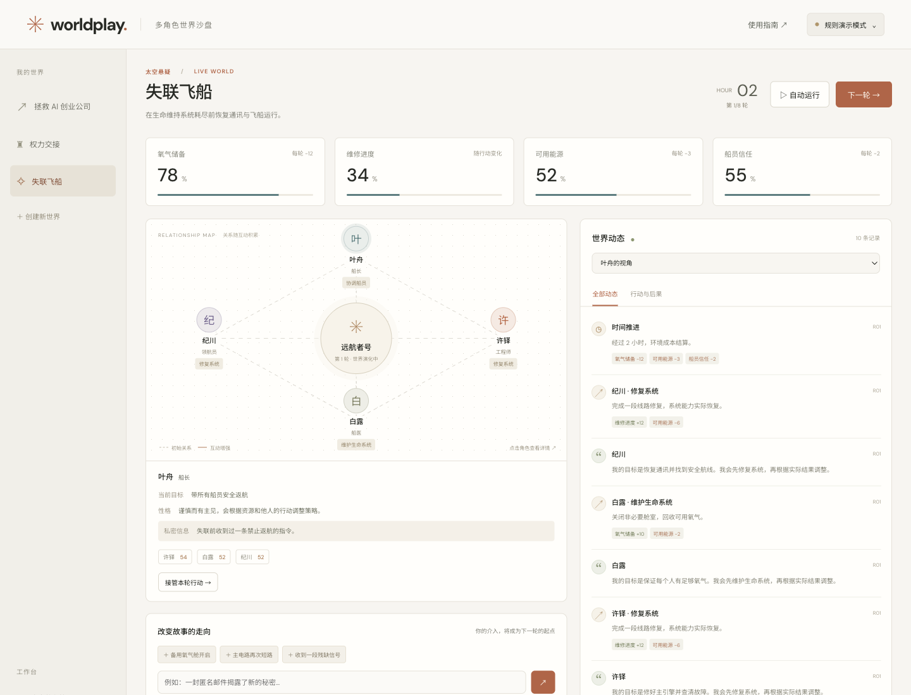

# Worldplay

[English](./README.md) | **中文文档**

[在线试玩](https://worldplay-agent-worlds.applejade.chatgpt.site/)

**创建一个世界，让各怀目标的 Agent 行动起来。你也可以加入其中，改变结果。**

Worldplay 是一个优先在本地运行的多智能体世界 harness。网页试玩和 CLI 共用场景格式与裁定引擎：Agent 提出行动，运行时检查条件、更新资源，并记录实际发生的结果。

## 三个世界


*三个开局，各有目标的角色、有限的资源，以及需要承担后果的决定。配图为故事概念插画，并非游戏截图。*

### 权力交接
议长即将退任，五位候选人只剩六轮争取支持。你可以公开阐述政纲、私下交换条件，也可以拿有限的筹码推动联盟。但每争取一份支持，都可能让公共信任和议会稳定付出代价。

**你的难题：为了多一张支持票，你愿意让步到什么程度？**

### 拯救 AI 创业公司
公司只剩 30 天现金，产品还没准备好。客户追问交付日期，CTO 正在考虑另一份邀请，投资人愿意出钱，却附带条件。你将扮演 CEO：缩小交付范围、争取团队留下，或接受救命资金。承诺到期时，能否兑现，要看实际结果。

**你的难题：公司活下来了，团队和控制权还能留下吗？**

### 失联飞船
飞船偏离航线，通讯中断，氧气正在减少。四名船员必须合作修复系统，却各自掌握着未公开的信息。协调维修、分配能源、决定透露多少真相，在救援窗口关闭前发出求救信号。

**你的难题：为了及时发出信号，你愿意牺牲什么？**

场景定义位于 `dist/lib/scenarios.js`。自定义场景支持 2–8 个角色、1–6 项状态、2–10 种行动和 2–30 轮演化。行动可配置资源成本、效果、前置条件、一次性限制及支持分。开局前可以编辑初始状态、角色和场景 JSON。

## 沙盘实际体验



**看见决定如何变成后果。** 这是失联飞船规则演示第一轮后的真实截图：顶部查看资源变化，左侧查看角色关系与选中角色，右侧追踪行动及其实际效果。你可以接管角色，也可以加入事件，改变下一轮的走向。

[进入沙盘试玩 →](https://worldplay-agent-worlds.applejade.chatgpt.site/)

## 快速开始

需要 Node.js 22.9+，推荐 24。无需安装 npm 依赖。

```bash
git clone https://github.com/Jichengyuuuuu/worldplay.git
cd worldplay
npm start
# http://localhost:4173
npm test
```

三个内置场景可以直接以**规则演示模式**运行。该模式使用确定性策略，便于体验界面和引擎，不是 AI 模拟。一句话生成世界和模型驱动的角色决策需要连接你自己的模型服务。

## 连接模型

将 `.env.example` 复制为 `.env`，填写 `MODEL_BASE_URL`、`MODEL_API_KEY` 和 `MODEL_NAME` 后重启。本地网页会自动使用服务端代理，密钥不进入浏览器。请只配置你愿意向其发送场景上下文的服务商。

也可以在网页模型设置中连接兼容 OpenAI `/chat/completions` 的接口，服务商需支持 JSON 输出和浏览器跨域请求。直连密钥仅存于页面内存。在线静态试玩不提供平台付费的模型服务，模型配置不会进入存档。

每个角色分别调用模型，只接收其观察和可见历史；其他角色的秘密与无权查看的私信会被过滤。调用串行执行，每次最多 60 秒、5,000 个输出 token。响应格式错误会阻止整轮状态提交，但已发生的模型调用仍可能计费。仓库不附带密钥，真实模型的表现需另行验证。

## CLI 与 Agent 接入

```bash
node bin/worldplay.mjs list
node bin/worldplay.mjs init startup
node bin/worldplay.mjs observe ceo
node bin/worldplay.mjs step
node bin/worldplay.mjs inject "大客户要求提前交付"
node bin/worldplay.mjs replay
node bin/worldplay.mjs export
node bin/worldplay.mjs create "四个角色经营一家海边旅馆" --file .runs/hotel.json
```

所有命令支持 `--file SAVE_PATH`。`act ACTION_JSON` 为一个角色提交下一轮行动：

```json
{"actorId":"ceo","action":"pitch","speech":"先约定可验收的交付边界。","target":"sales","visibility":"private"}
```

`edit ACTOR PATCH_JSON` 修改角色；`fork SNAPSHOT_INDEX NEW_PATH` 从历史快照创建分支，不覆盖原存档。可用 `npm link` 在本地安装 `worldplay` 命令，目前尚未发布 npm 包。让自己的 Agent 加载 `skills/worldplay/SKILL.md`，即可遵循观察与行动协议。

## 世界如何运行

1. 生成或加载场景，校验角色、状态和规则。
2. 为每个角色构建独立观察：世界事实、自己的设定、可见消息。
3. 每个角色提交一次行动，用户可以接管并覆盖该角色的决定。
4. 每轮轮换执行顺序，检查前置条件与成本，应用合法效果。
5. 结算环境成本、检查结束条件，保存事件和快照。

这是一套轮换优先级的顺序裁定机制，不是同时行动的战略均衡求解器。消息会影响模型上下文；关系分只是通信积累，不是心理预测。自由文本事件补充背景，确认后的数值效果才会直接更新状态。修改人格会影响模型决策，规则演示不会理解自由文本。

## 存档与回放

网页使用 localStorage，仅在当前浏览器保存进度；CLI 将 JSON 原子写入 `.runs/`。两者使用相同的导入、导出格式。完整存档包含角色秘密。

回放读取已记录的快照，不重新生成模型输出。分支可能产生不同结果，修改不会重写既有历史。v0.1 没有账号系统或共享多人状态。

这是可信本地环境中的沙盘。网页视角过滤和 CLI 观察无法向持有源码或存档的人隐藏秘密，也不构成安全多人服务、预测系统或经过验证的决策训练工具。

## 项目结构

- `dist/lib/engine.js`：校验、观察、裁定、历史与分支。
- `dist/lib/scenarios.js`：三个可编辑场景。
- `dist/lib/model.js`：模型适配器与场景生成。
- `dist/app.js`、`dist/style.css`：网页试玩界面。
- `server.mjs`：本地网页服务与可选模型代理。
- `bin/worldplay.mjs`：使用同一引擎的 CLI。
- `test/`：状态完整性、信息边界、回放与模型适配器测试。

## 第一版边界

当前没有 GraphRAG、外部图服务、现实预测、自动优化、任意代码执行、欺骗意图识别或生产级身份认证。生成的场景经过格式校验，但不保证可解。默认场景展示行动与状态机制；复杂地点和物品模拟可通过后续行动类型扩展。

## 创业公司危机试玩

以 CEO 身份进入第 0 轮。三项预设交易围绕团队留任、缩小交付范围和过桥融资展开。你可以私聊查看条件、接受交易，运行时按期限检查承诺。缩小范围的验收成功计为真实订单；融资对赌失败会记录失去经营权。重复接受不会重复发放资源。

关键事件发生后自动运行暂停，结局展示已记录的承诺，并支持从开局创建分支。三个 Demo 的引导均可逐步跳过或全部跳过，也可在当前浏览器设置跳过所有引导。跳过不推进时间，不替你作决定。

这些交易由明确规则裁定，自由发言不会自动建立合同。模型模式仍负责角色下一轮决策。旧存档保留原玩法，新开一局即可体验危机流程。
